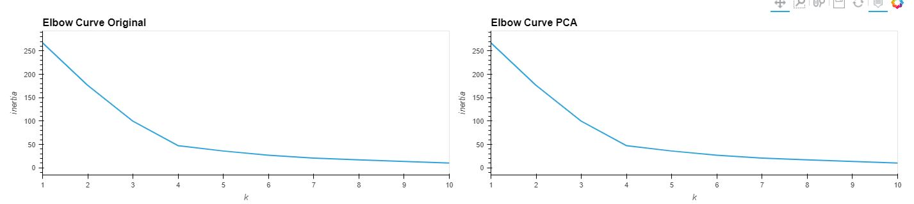

# Crypto-Clustering

This repo represents Jupyter notebook that clusters cryptocurrencies by their performance in different time periods, and plots results.

---

## Approach

1. Original data:

- Prepare data
- Find the Best Value for k Using the Original Data
- Cluster Cryptocurrencies with K-means Using the Original Data

2. Optimize Clusters with Principal Component Analysis

3. PCA data:

- Prepare data
- Find the Best Value for k Using the PCA Data
- Cluster data with K-means Using the Original Data

- Visualize and Compare the Results

---

## Technologies

This project leverages the following tools for financial analysis:

- [Conda](https://docs.conda.io/en/latest/) - source package management system and environment management system.

- [Pandas](https://pandas.pydata.org) - Python library that’s designed specifically for data analysis.

- [JupyterLab](https://jupyter.org) - For running and review Python-based programs.

- [KMeans](https://scikit-learn.org/stable/modules/generated/sklearn.cluster.KMeans.html) - For find groups which have not been explicitly labeled in the data.

- [PCA](https://scikit-learn.org/stable/modules/generated/sklearn.decomposition.PCA.html) - For reducing the dimensionality of such datasets, increasing interpretability but at the same time minimizing information loss.

- [StandardScaler](https://scikit-learn.org/stable/modules/generated/sklearn.preprocessing.StandardScaler.html) - For Standardization of datasets

---

## Input data

Crypto market data - `/Resources/crypto_market_data.csv`, contains prices changes in different time periods.

---

## Running analisys

1. Install Jupyter Lab
2. Install Anaconda framework
3. Install `pip install -U scikit-learn`
4. Install `conda install -c pyviz hvplot`
5. Clone repository
6. Open Jupyter notebook in the project folder
7. Open `*.ipynb` file and run it

---

## Import data

```
df_market_data = pd.read_csv(
    Path("Resources/crypto_market_data.csv"),
    index_col="coin_id")
```

Plot imported data:


---

## Prepare the Data

```
# Use the `StandardScaler()` module from scikit-learn to normalize the data from the CSV file
scaled_data = StandardScaler().fit_transform(df_market_data)
```

```
# Create a DataFrame with the scaled data
df_market_data_scaled = pd.DataFrame(
    scaled_data,
    columns=df_market_data.columns
)

# Copy the crypto names from the original data
df_market_data_scaled["coin_id"] = df_market_data.index

# Set the coinid column as index
df_market_data_scaled = df_market_data_scaled.set_index("coin_id")
```

## Find the Best Value for k Using the Original Data


Based on elbow curve plot, the best value for k is 4. Inerthia in that case 79.

## Cluster Cryptocurrencies with K-means Using the Original Data


## Optimize Clusters with Principal Component Analysis

```
# Create a PCA model instance and set `n_components=3`.
pca = PCA(n_components=3)`

# Use the PCA model with `fit_transform` to reduce to
# three principal components.
market_pca_data = pca.fit_transform(df_market_data_predictions)

pca.explained_variance_ratio_
```

The total explained variance of the three principal components is 89.49%.

```
array([0.36384149, 0.35308123, 0.17298865])
```

## Find the Best Value for k Using the PCA Data


The best value for k when using the PCA data is 4.
k is the same, comparing to k of original data.

## Cluster Cryptocurrencies with K-means Using the PCA Data


## Visualize and Compare the Results




After a visual analysis of the clustered results, we can say for sure that reducing the data to cluster the data makes the data more readable and accurate.

---

## Contributors

Vladislav Glupak - [Linkedin](https://www.linkedin.com/in/vladislav-glupak/)

---

## License

It is an Open-source analysis.
